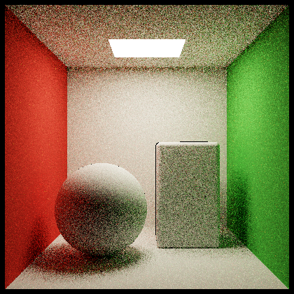
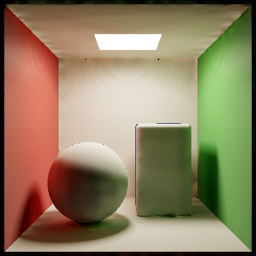
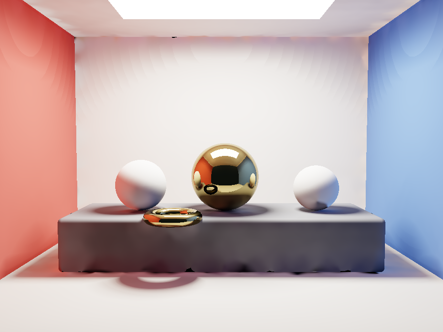
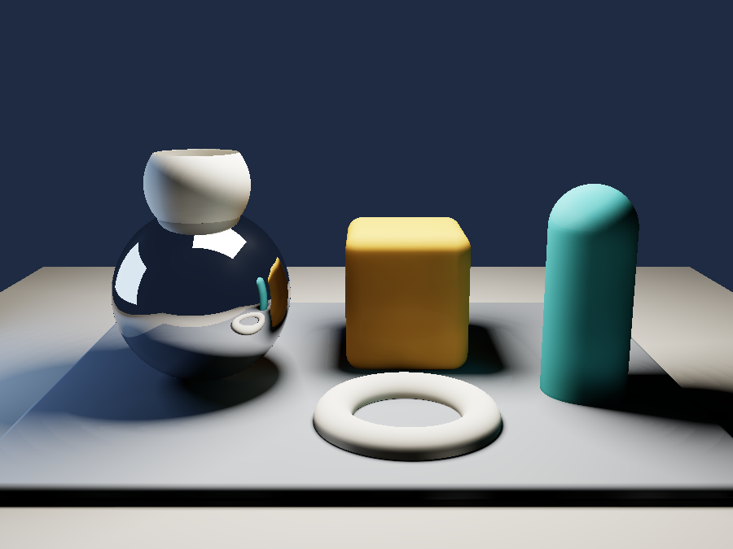

<div align="center">

# Interflect

**A renderer that doesn't sample. It solves.**

[](https://github.com/Cherie05/interflect/actions/workflows/ci.yml)
[](https://github.com/Cherie05/interflect/releases)
[](https://crates.io/crates/interflect)
[](LICENSE)
[](https://www.rust-lang.org)

No Monte Carlo. No denoiser. No GPU. No model weights.
**0.5 MB. Three dependencies.**

</div>

---

## Both of these took the same time

| Path tracer &mdash; 1642 ms | **Interflect &mdash; 1499 ms** |
|:---:|:---:|
|  |  |
| 8 samples per pixel | **1 evaluation per pixel** |

The left image is grainy because a path tracer *guesses*, then averages millions
of guesses. Reaching the quality on the right takes it **28 seconds** &mdash; or a
neural denoiser.

Interflect has no grain to remove. It computes the answer directly, so there is
no sample count, nothing to converge, and nothing to clean up afterwards.

<div align="center">


<br>
<sub>Left: the light never touches the red or blue walls directly. Every trace of colour on the white spheres arrived by bounce.</sub>
</div>

---

## Measured, not claimed

Against a converged path trace of the identical scene. Reproduce with `./bench.sh`.

| Scene | Interflect | Path tracer | Speedup | SSIM | Energy |
|---|---:|---:|---:|---:|---:|
| `sphere_only` | 1381 ms | 26136 ms | **18.9&times;** | 0.850 | 1.090 |
| `box_only` | 1757 ms | 39115 ms | **22.3&times;** | 0.839 | 1.066 |
| `high_albedo` | 1395 ms | 31190 ms | **22.4&times;** | 0.820 | 1.049 |
| `cornell` | 1613 ms | 28364 ms | **17.6&times;** | 0.806 | 1.050 |

**Read SSIM against a ceiling of 0.892, not 1.0.** The reference is stochastic,
and SSIM penalises its own noise even against a perfect image &mdash; two references
of the *same* scene differing only in sample count score 0.892 against each
other. Total energy lands within 4.9&ndash;9.0% of ground truth.

6-core / 12-thread AMD Ryzen 5 4600H, 260&times;260, reference at 384 spp.

### Output is bit-identical. Always.

```console
$ interflect render scenes/cornell.rad -o a.png -t 1
$ interflect render scenes/cornell.rad -o b.png -t 12
$ md5sum a.png b.png
766c77aeb5d34275625765212ebaa9b6  a.png
766c77aeb5d34275625765212ebaa9b6  b.png
```

Same file on 1 core or 12, today or next year. CI enforces it on every commit.

---

## Install

**No Rust needed.** Downloads a 0.5 MB binary:

```bash
curl -fsSL https://raw.githubusercontent.com/Cherie05/interflect/main/install.sh | sh
```

```powershell
irm https://raw.githubusercontent.com/Cherie05/interflect/main/install.ps1 | iex
```

Rather not pipe a script to a shell? Plain archives and `SHA256SUMS` are on the
[Releases page](https://github.com/Cherie05/interflect/releases).

<details>
<summary><b>Other ways to install</b></summary>

```bash
cargo binstall interflect   # prebuilt, no compile
cargo install interflect    # builds from source
```

From source:

```bash
git clone https://github.com/Cherie05/interflect
cd interflect
cargo build --release       # ~15 s
```

</details>

## First render

```bash
interflect render scenes/product.rad -o out.png
```

```console
interflect 0.1.0
  scene      7 objects, 2 lights, 6 materials, 3 bvh nodes
  film       640x480
  surfels    12270 placed of 20000 requested   (334 ms)
  transfer   311 clusters, 110026 links, row-sum 0.109, 10.4M sdf evals   (87 ms)
  solve      12 bounces, residual 5.37e-5, 0.3M sdf evals   (6 ms)
  shade      137 ms   15.3M sdf evals   50 evals/px
  total      564 ms
```

---

## The idea

**Radiosity died in the 1990s because it needed meshing. Signed distance fields
don't have meshes. So it deserves a second look &mdash; and with no GPU and no
denoiser allowed, it wins.**

Classical radiosity ([Goral et al., 1984](https://history.siggraph.org/learning/modeling-the-interaction-of-light-between-diffuse-surfaces-by-goral-torrance-greenberg-and-battaile/))
produced beautiful, completely noise-free, view-independent global illumination.
It lost to path tracing for one reason: it needed every surface subdivided into
well-conditioned patches, and automatic meshing was fragile, slow and
artefact-prone.

An SDF has no mesh to subdivide. Its surface is the zero level set, and **any
point in space projects onto it** by Newton iteration along the gradient &mdash;
`p ← p − f(p)·∇f(p)` &mdash; converging in a handful of steps. Patches generate
directly, at any density, with no topology, no seams and no failure cases.

Nobody revisited this because from 1995 onward everyone moved to GPUs, where
Monte Carlo plus a neural denoiser is unbeatable. Refuse the GPU and refuse the
denoiser, and the calculus inverts.

<details>
<summary><b>How the pipeline works</b></summary>

| Stage | What happens |
|---|---|
| `sdf.rs` / `bvh.rs` | Analytic primitives with CSG. A binned-SAH BVH turns the nearest-distance query from O(n) to O(log n). |
| `surfel.rs` | **New.** A Halton point set is projected onto the SDF surface by Newton iteration, then Poisson-disc thinned. No mesh, no RNG. |
| `ltc.rs` / `shade.rs` | Area lights integrated in closed form &mdash; Lambert's polygon formula, the identity case of Linearly Transformed Cosines. Shadows are cone-traced from the distance field. Both noise-free. |
| `formfactor.rs` | **New.** Nusselt-analog disc-to-disc form factors between surfels and normal-bucketed clusters, with cone-traced visibility, built once into a sparse CSR matrix. |
| `solve.rs` | **New.** Jacobi iteration on the cached matrix. Each extra bounce is one sparse mat-vec. |

Because the solve is **view-independent**, a new camera costs only the gather
pass. `--turntable 12` renders twelve orbit frames from one solve &mdash; 390 ms to
solve, then 80 ms per frame.

</details>

---

## Making your own scene

Scenes are plain text. **You never touch Rust.**

### The easy way

Open [`tools/scene-builder.html`](tools/scene-builder.html) in any browser. Drag
shapes in a front and top view, set sizes and colours with sliders, and it
writes the scene file for you. Single offline HTML file &mdash; no server, no build,
no 3D experience needed.

### The direct way

```bash
cp scenes/TEMPLATE.rad scenes/mine.rad
interflect render scenes/mine.rad -o mine.png -w 300 -h 220   # ~0.2 s
```

Two rules cover most of it: **the floor is at Y = 0**, and **to rest something
on the floor, set its Y to its radius.**

```
render   { width: 800, height: 600, surfels: 20000, bounces: 16 }
camera   { pos: [0, 1.8, 6.0], look: [0, 0.7, 0], fov: 38 }
material "red" { albedo: [0.70, 0.15, 0.12], roughness: 0.8 }

sphere   { center: [0, 0.6, 0], radius: 0.6, mat: "red" }
box      { center: [1.6, 0.5, 0], size: [1, 1, 1], round: 0.08, mat: "red" }
capsule  { a: [0,0,0], b: [0,1.3,0], radius: 0.25, mat: "red" }   # rounded ends
cylinder { a: [0,0,0], b: [0,1.0,0], radius: 0.3, mat: "red" }    # flat ends
cone     { a: [0,0,0], b: [0,1.1,0], radius: 0.4, mat: "red" }    # to a point
torus    { center: [0, 0.12, 0], major: 0.45, minor: 0.12, mat: "red" }

# drill a hole -- no boolean rebuild, no re-tessellation
sphere { center: [0,1,0], radius: 0.5, mat: "red", subtract_sphere: [[0,1.2,0], 0.4] }

# vertices counter-clockwise as seen from the emitting side
light { verts: [[-1.5,4,-1.5],[1.5,4,-1.5],[1.5,4,1.5],[-1.5,4,1.5]], emit: [13,12.5,11.5] }
```

---

## Commands

```
interflect render <scene.rad> [OPTIONS]

  -o, --output <FILE>    output PNG                  [default: out.png]
  -t, --threads <N>      worker threads              [default: all cores]
  -w, --width  <N>       override scene width
  -h, --height <N>       override scene height
      --mode <MODE>      beauty | direct | indirect | reference
                         | normals | depth | steps
      --surfels <N>      override surfel count
      --bounces <N>      override bounce count
      --clusters <N>     transfer cluster resolution [default: 8]
      --spp <N>          samples/pixel for --mode reference
      --turntable <N>    N orbit frames from one GI solve
      --no-bvh           linear scan; verifies BVH correctness
```

`--mode direct` renders without the solve. The difference against `beauty` is
exactly what the radiosity contributes.

---

## FAQ

<details>
<summary><b>Is this faster than Blender Cycles or PBRT?</b></summary>

For the scenes it targets, against a converged render, yes &mdash; roughly 20&times;.
But it is not a Cycles replacement. It has no caustics, no refraction, no
participating media and no triangle meshes. It renders analytic primitives with
correct diffuse global illumination, very fast, with no noise.
</details>

<details>
<summary><b>Why no denoiser?</b></summary>

There is nothing to denoise. Denoisers exist to clean up Monte Carlo variance,
and this renderer has no Monte Carlo in it. Every modern denoiser is also a
neural network, which would break the "no model weights" property.
</details>

<details>
<summary><b>Why does determinism matter?</b></summary>

Reproducibility. A render from this repo today produces a byte-identical file
next year, on any thread count. That constrains the whole design &mdash; no RNG, no
parallel float reductions, Jacobi instead of Gauss-Seidel &mdash; and CI enforces
it. See [CONTRIBUTING.md](CONTRIBUTING.md).
</details>

<details>
<summary><b>Can it render a photorealistic person, animal, or product photo?</b></summary>

No. There is no fur, no cloth, no skin, and no way to import a model. The
vocabulary is spheres, boxes, capsules, cylinders, cones and tori. You can build
a stylised figure from those &mdash; `scenes/dog.rad` does &mdash; but it will read as a
toy, not a photograph.
</details>

<details>
<summary><b>What is it actually good for?</b></summary>

Product and packaging shots, architectural interiors, abstract and generative
compositions, motion-graphics stills, turntables, and CI pipelines that need
deterministic images without a GPU.
</details>

<details>
<summary><b>Why "Interflect"?</b></summary>

From **interreflection** &mdash; the term for light bouncing between surfaces, which
is exactly what the solver computes. The difference between `--mode direct` and
`--mode beauty` *is* the interreflected light.
</details>

---

## What it will not do

Honest limits, and most of them are what make it fast:

- **No caustics.** Light focused through glass needs bidirectional transport.
- **No refraction.** Dielectrics are not implemented.
- **Blurry reflections are attenuated, not blurred.** The specular indirect path
  traces the exact mirror direction; a roughness-driven cone trace is next.
- **Diffuse-dominant GI.** Full glossy interreflection is out of scope.
- **No participating media.** No fog, smoke or subsurface scattering.
- **Analytic primitives only.** No triangle meshes.
- **Known artefact:** faint contour banding in penumbrae where a shadow ray runs
  nearly parallel to a large surface.

---

## Contributing

[CONTRIBUTING.md](CONTRIBUTING.md) has the two rules specific to this project &mdash;
a bug fix ships with a test that fails first, and determinism is not negotiable
&mdash; plus a list of good first issues.

[TESTING.md](TESTING.md) covers four testing tiers, what CI gates, and a
catalogue of what each failure mode looks like on screen.

**25 regression tests.** Every test in `bvh`, `ltc`, `trace`, `formfactor` and
`solve` reproduces the failure signature of a real bug found during development.
They are not coverage padding.

## Credits

Almost nothing here is original. The novel piece is the *combination*: meshless
surfel placement on an SDF feeding a classical radiosity solve.

[CREDITS.md](CREDITS.md) names everyone whose work is in the code &mdash; Goral,
Torrance, Greenberg and Battaile for radiosity; Hart for sphere tracing; Nusselt
for the form factor; Lambert and Heitz for the area lights; Quilez for the
distance functions &mdash; with citations.

## License

[MIT](LICENSE)
