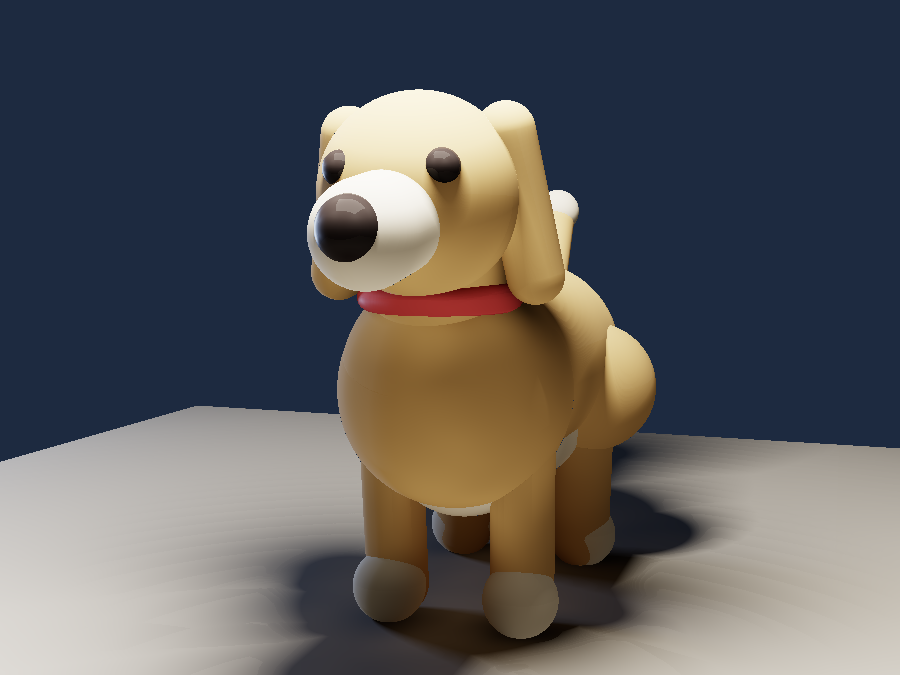
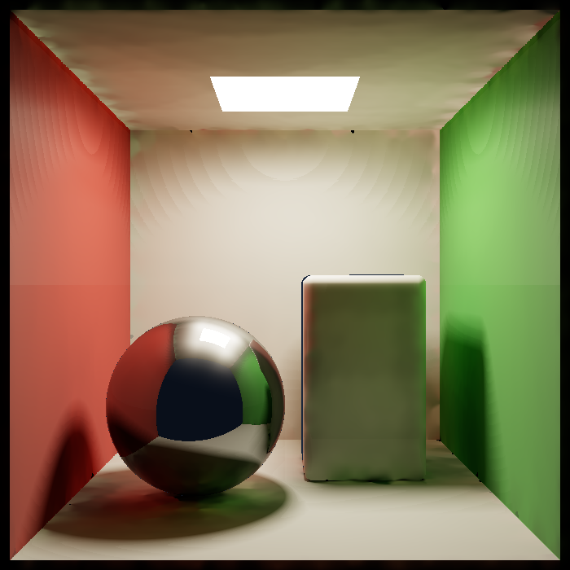

# Interflect

A noise-free CPU renderer. Deterministic surfel radiosity on signed distance
fields — no Monte Carlo, no denoiser, no GPU, no model weights.

<p align="center">
  
  
</p>
<p align="center">
  
  
</p>
<p align="center">
  <sub>All four rendered on CPU in under 2 seconds each. No denoiser — there is no noise to remove.</sub>
</p>

In the alcove image above, the light never touches the red or blue walls
directly. Every trace of colour on the white spheres arrived by bounce.

[](https://github.com/Cherie05/interflect/actions/workflows/ci.yml)

Every pixel is correct on its first and only evaluation. There is no sample
count, no convergence to wait for, and no grain to clean up.

## Getting started

```bash
git clone https://github.com/Cherie05/interflect
cd interflect
cargo build --release
./target/release/interflect render scenes/product.rad -o out.png
```

Three dependencies, ~15 s to build, a 536 KB binary. No assets to download.

### Making your own scene

Scenes are plain text — you never touch Rust.

**The easy way** — open [`tools/scene-builder.html`](tools/scene-builder.html)
in any browser. Drag shapes around in a front and top view, set sizes and
colours with sliders, and it writes the scene file for you. No 3D knowledge, no
install, no server; it is a single offline HTML file.

**The direct way** — start from the annotated template, which explains every
number and needs no 3D background:

```bash
cp scenes/TEMPLATE.rad scenes/mine.rad
# edit the numbers, then:
./target/release/interflect render scenes/mine.rad -o mine.png -w 300 -h 220
```

The small size renders in about 0.2 s, so you can change a coordinate and look
again immediately. Two rules cover most of it: **the floor is at Y = 0**, and
**to rest something on the floor, set its Y to its radius**.

## The idea

**Radiosity died in the 1990s because it required meshing. Signed distance
fields eliminate meshing. So it deserves a second look — and with no GPU and no
AI allowed, it wins.**

Classical radiosity (Goral et al., 1984) produced beautiful, completely
noise-free, view-independent global illumination. It lost to path tracing for
one reason: it needed surfaces subdivided into well-conditioned patches, and
automatic meshing was fragile, slow and artefact-prone.

An SDF has no mesh to subdivide. Its surface is the zero level set, and any
point in space projects onto it by Newton iteration along the gradient —
`p ← p − f(p)·∇f(p)` — converging in a handful of steps because `|∇f| = 1` for a
true distance field. Patches can be generated directly, at any density, with no
topology, no seams and no failure cases. The obstacle that killed radiosity is
simply not present.

Nobody revisited this because from 1995 onward everyone moved to GPUs, where
Monte Carlo plus a neural denoiser is unbeatable. Refuse the GPU and refuse the
denoiser and the calculus inverts.

## How it works

| Stage | What happens |
|---|---|
| `sdf.rs` / `bvh.rs` | Analytic primitives with CSG; a binned-SAH BVH turns the nearest-distance query from O(n) into O(log n). |
| `surfel.rs` | **New.** A Halton point set is projected onto the SDF surface by Newton iteration, then Poisson-disc thinned. No mesh, no RNG. |
| `ltc.rs` / `shade.rs` | Area lights integrated in closed form (Lambert's polygon formula — the identity case of Linearly Transformed Cosines). Shadows are cone-traced from the distance field. Both noise-free. |
| `formfactor.rs` | **New.** Nusselt-analog disc-to-disc form factors between surfels and normal-bucketed clusters, with cone-traced visibility, built once into a sparse CSR matrix. |
| `solve.rs` | **New.** Jacobi iteration on the cached matrix. Every extra bounce is one sparse mat-vec. |
| `reference.rs` | A brute-force path tracer, included only as benchmark ground truth. |

Because the solve is **view-independent**, a new camera costs only the gather
pass. `--turntable 12` renders twelve orbit frames from a single solve.

## Measured results

All figures from `./bench.sh` on a 6-core / 12-thread AMD Ryzen 5 4600H, 260×260, against the built-in
path tracer at 384 spp. Reproduce with `cargo build --release && ./bench.sh`.

### Accuracy — Lambertian scenes vs path-traced ground truth

| Scene | ours | reference | speedup | SSIM | energy ratio |
|---|---|---|---|---|---|
| `sphere_only` | 1381 ms | 26136 ms | **18.9×** | 0.850 | 1.090 |
| `box_only` | 1757 ms | 39115 ms | **22.3×** | 0.839 | 1.066 |
| `high_albedo` | 1395 ms | 31190 ms | **22.4×** | 0.820 | 1.049 |
| `cornell` | 1613 ms | 28364 ms | **17.6×** | 0.806 | 1.050 |

**Read these against a ceiling of ≈0.89, not 1.0.** The reference is stochastic,
and SSIM penalises its residual noise even against a perfect image: two
references of the *same* scene differing only in sample count (128 vs 512 spp)
score 0.892 against each other. Total energy lands within 4.9–9.0% of ground
truth.

The accuracy suite is fully Lambertian by necessity — the reference integrator
is diffuse-only, so a glossy scene would measure the gap between two BSDFs
rather than the accuracy of the light transport.

### Resolution scaling (`product.rad`, 12 threads)

| Resolution | GI solve (once) | shade | total |
|---|---|---|---|
| 640×480 | 390 ms | 147 ms | **537 ms** |
| 1920×1080 | 390 ms | 857 ms | **1256 ms** |
| 1920×1080 turntable | 390 ms | 935 ms/frame | 12 frames in 11.2 s |

The shade pass measures 47 SDF evaluations per pixel. Note what that implies:
the workload is **not** FLOP-bound. At 98.2M evaluations in 857 ms across 12
cores the effective rate is ~9 GFLOP/s, far below what the arithmetic alone
would allow — the cost is BVH traversal, pointer chasing and branch
misprediction, not floating-point throughput. Optimisation effort belongs in
memory layout, not in wider SIMD.

### Determinism

Output is **bit-identical** across 1, 4, 8 and 12 threads, and across repeated
runs. Verified by md5 in `bench.sh`. This is a design constraint, not a
coincidence:

- No RNG anywhere in the render path — Halton sequences with fixed indices.
- Jacobi, not Gauss-Seidel: it reads only the previous iterate, so row updates
  commute. Gauss-Seidel converges faster but its result depends on update order.
- Cluster aggregation runs serially, because a parallel float reduction sums in
  nondeterministic order.
- Clusters are sorted by key before use, because `HashMap` iteration order is
  unspecified.

## Testing

```bash
cargo test --release     # 21 tests, ~15 s
./bench.sh               # accuracy + speed + determinism gate
```

Every test in `bvh`, `ltc`, `trace`, `formfactor` and `solve` reproduces the
failure signature of a real bug found during development — they are not coverage
padding.

CI additionally gates the claims the unit tests cannot reach: bit-identical
output across thread counts, `--no-bvh` changing speed but not pixels, energy
conservation in a sealed scene, solve convergence, energy agreement with the
path-traced reference, and clean rejection of malformed input — on Linux,
Windows and macOS. [TESTING.md](TESTING.md) has the four testing tiers, what the suite
deliberately does **not** cover, and a catalogue of what each failure mode looks
like on screen.

## What it does not do

Honest limits, and most of them are the same limits that make it fast:

- **No caustics.** Light focused through glass needs bidirectional transport.
- **No refraction.** Dielectrics are not implemented.
- **Blurry reflections are attenuated, not blurred.** The specular indirect path
  traces the exact mirror direction; a roughness-driven cone trace is the next
  upgrade.
- **Diffuse-dominant GI.** Full glossy interreflection is out of scope.
- **No participating media** (fog, smoke, subsurface).
- **Analytic primitives and SDF CSG only.** No triangle meshes.
- **Known artefact:** faint contour banding remains in the penumbra where a
  shadow ray runs nearly parallel to a large surface, because the SDF distance
  is omnidirectional and reports a small value for a surface the ray never hits.

## Scene format

```
render { width: 800, height: 800, surfels: 16000, bounces: 16 }
camera { pos: [0, 2, 7.6], look: [0, 2, 0], fov: 42 }

material "red" { albedo: [0.62, 0.07, 0.06], roughness: 0.9 }

box     { center: [0, -0.1, 0], size: [4.4, 0.2, 4.4], mat: "red" }
sphere  { center: [0, 1, 0], radius: 0.85, mat: "red" }
capsule  { a: [0,0,0], b: [0,1,0], radius: 0.3, mat: "red" }   # rounded ends
cylinder { a: [0,0,0], b: [0,1,0], radius: 0.3, mat: "red" }   # flat ends
cone     { a: [0,0,0], b: [0,1,0], radius: 0.5, mat: "red" }   # tapers to a point
cone     { a: [0,0,0], b: [0,1,0], radius: 0.5, radius_top: 0.2, mat: "red" }
torus   { center: [0,0,0], major: 0.5, minor: 0.15, mat: "red" }

# CSG subtraction stays inside the object, so its AABB — and the BVH — stay valid
sphere { center: [0,1,0], radius: 0.5, mat: "red", subtract_sphere: [[0,1.2,0], 0.4] }

# vertices counter-clockwise as seen from the emitting side
light { verts: [[-0.7,3.9,-0.7],[0.7,3.9,-0.7],[0.7,3.9,0.7],[-0.7,3.9,0.7]],
        emit: [17, 15, 12] }
```

## CLI

```
interflect render <scene.rad> [OPTIONS]

  -o, --output <FILE>    output PNG                  [default: out.png]
  -t, --threads <N>      worker threads              [default: all cores]
  -w, --width  <N>       override scene width
  -h, --height <N>       override scene height
      --mode <MODE>      beauty | direct | indirect | reference | normals | depth | steps
      --surfels <N>      override surfel count       [default: from scene]
      --bounces <N>      override bounce count
      --clusters <N>     transfer cluster resolution [default: 8]
      --spp <N>          samples/pixel for --mode reference
      --turntable <N>    N orbit frames from one GI solve
      --no-bvh           linear scan; verifies BVH correctness
```

`--mode direct` renders without the solve. The difference against `beauty` is
exactly what the radiosity contributes.

## Dependencies

`glam`, `rayon`, `image`. That is the whole list.

## License

MIT
